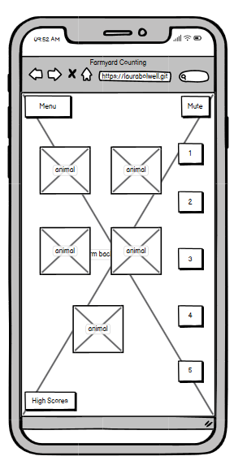

# FARMYARD COUNTING

Farmyard Counting is a counting game aimed at young children of pre-school age and those just starting out in school. It has minimal and easy-to-operate controls, bright colors, two levels of difficulty and fun sound effects so that children can practise their counting and number recognition skills in an enjoyable way.

The game is designed to be fully responsive, allowing it to be played on a wide range of devices.


I used http://ui.dev/amiresponsive[http://ui.dev/amiresponsive](https://ui.dev/amiresponsive?url=https://laurabolwell.github.io/farmyard-counting-game) to create this image.

## UX

⚠️⚠️⚠️⚠️⚠️ START OF NOTES (to be deleted) ⚠️⚠️⚠️⚠️⚠️

In this section, you will briefly explain your design processes.

🛑🛑🛑🛑🛑 END OF NOTES (to be deleted) 🛑🛑🛑🛑🛑

### Colour Scheme


The game uses bright, child-friendly colours. I used [coolors.co](https://coolors.co/67c93e-dc3545-ffc107-ffd65c) to generate my colour palette.

- `#FFC107` used for answer buttons and to highlight the score count.
- `#DC3545` used for game control buttons.
- `#FFD65C` used for background colour of modals.
- `#67C93E` is the main colour of the main game background image and also used as the background for trophy display.

I've used CSS `:root` variables to easily update the global colour scheme by changing only one value, instead of everywhere in the CSS file.

```css
:root {
    --red: #DC3545;
    --amber: #FFC107;
    --light-amber: #FFD65C;
    --green: #67C93E;
}
```

### Typography

- [Short stack](https://fonts.google.com/specimen/Short+Stack) was used for all text on the game screen and the modals.

- [Font Awesome](https://fontawesome.com) icons were used throughout the site, such as sound icon and the score counters.

## User Stories

### Players (age 2-5)

- As a player, I would like to easily find and understand the controls, so that I can play independently.
- As a player, I would like easy to operate controls, so that I can play on all devices.
- As a player, I would like to ____________, so that I can ____________.
- As a player, I would like to ____________, so that I can ____________.
- As a player, I would like to ____________, so that I can ____________.

### Returning Site Users

- As a returning site user, I would like to ____________, so that I can ____________.
- As a returning site user, I would like to ____________, so that I can ____________.
- As a returning site user, I would like to ____________, so that I can ____________.
- As a returning site user, I would like to ____________, so that I can ____________.
- As a returning site user, I would like to ____________, so that I can ____________.

### Site Admin

- As a site administrator, I should be able to ____________, so that I can ____________.
- As a site administrator, I should be able to ____________, so that I can ____________.
- As a site administrator, I should be able to ____________, so that I can ____________.
- As a site administrator, I should be able to ____________, so that I can ____________.
- As a site administrator, I should be able to ____________, so that I can ____________.

## Wireframes

To follow best practice, wireframes were developed for mobile, tablet, and desktop sizes.
I've used [Balsamiq](https://balsamiq.com/wireframes) to design my site wireframes.

### Start of Game Modal Wireframes

<details>
<summary>Click to see the Start of Game Modal Wireframes</summary>

| Size | Screenshot |
| --- | --- |
| Mobile |  |
| Tablet |  |
| Desktop |  |

</details>

### Main Game Page Wireframes

<details>
<summary>Click to see the Main Game Page Page Wireframes</summary>

| Size | Screenshot |
| --- | --- |
| Mobile |  |
| Tablet |  |
| Desktop |  |

</details>

### End of Game Modal Wireframes

<details>
<summary>Click to see the End of Game Modal Wireframes</summary>

| Size | Screenshot |
| --- | --- |
| Mobile |  |
| Tablet |  |
| Desktop |  |

</details>

## Features

⚠️⚠️⚠️⚠️⚠️ START OF NOTES (to be deleted) ⚠️⚠️⚠️⚠️⚠️

In this section, you should go over the different parts of your project,
and describe each in a sentence or so.

You will need to explain what value each of the features provides for the user,
focusing on who this website is for, what it is that they want to achieve,
and how your project is the best way to help them achieve these things.

For some/all of your features, you may choose to reference the specific project files that implement them.

IMPORTANT: Remember to always include a screenshot of each individual feature!

🛑🛑🛑🛑🛑 END OF NOTES (to be deleted) 🛑🛑🛑🛑🛑

### Existing Features

- **Title for feature #1**

    - Details about this particular feature, including the value to the site, and benefit for the user. Be as detailed as possible!


- **Title for feature #2**

    - Details about this particular feature, including the value to the site, and benefit for the user. Be as detailed as possible!


- **Title for feature #3**

    - Details about this particular feature, including the value to the site, and benefit for the user. Be as detailed as possible!


⚠️⚠️⚠️⚠️⚠️ START OF NOTES (to be deleted) ⚠️⚠️⚠️⚠️⚠️

Repeat as necessary for as many features as your site contains.

Hint: the more, the merrier!

🛑🛑🛑🛑🛑 END OF NOTES (to be deleted) 🛑🛑🛑🛑🛑

### Future Features

⚠️⚠️⚠️⚠️⚠️ START OF NOTES (to be deleted) ⚠️⚠️⚠️⚠️⚠️

Do you have additional ideas that you'd like to include on your project in the future?
Fantastic! List them here!
It's always great to have plans for future improvements!
Consider adding any helpful links or notes to help remind you in the future, if you revisit the project in a couple years.

🛑🛑🛑🛑🛑 END OF NOTES (to be deleted) 🛑🛑🛑🛑🛑

- Title for future feature #1
    - Any additional notes about this feature.
- Title for future feature #2
    - Any additional notes about this feature.
- Title for future feature #3
    - Any additional notes about this feature.

## Tools & Technologies Used

- [HTML](https://en.wikipedia.org/wiki/HTML) used for the main site content.
- [CSS](https://en.wikipedia.org/wiki/CSS) used for the main site design and layout.
- [CSS :root variables](https://www.w3schools.com/css/css3_variables.asp) used for reusable styles throughout the site.
- [CSS Flexbox](https://www.w3schools.com/css/css3_flexbox.asp) used for an enhanced responsive layout.
- [Bootstrap](https://getbootstrap.com) used as the front-end CSS framework for modern responsiveness and pre-built components.
- [JavaScript](https://www.javascript.com) used for user interaction on the site.
- [jQuery](https://jquery.com/) javascript library used for user interaction on the site.
- [Git](https://git-scm.com) used for version control. (`git add`, `git commit`, `git push`)
- [GitHub](https://github.com) used for secure online code storage.
- [GitHub Pages](https://pages.github.com) used for hosting the deployed front-end site.
- [Gitpod](https://gitpod.io) used as a cloud-based IDE for development.
- [Markdown Builder by Tim Nelson](https://traveltimn.github.io/markdown-builder/) used to help generate the Markdown files.
- [Tiny PNG](tinypng.com) used to compress images.
- [Favicon.io](favicon.io) used to create favicon.
- [Am I Responsive?](https://ui.dev/amiresponsive) used to show the website on a range of devices.


## Testing

For all testing, please refer to the [TESTING.md](TESTING.md) file.

## Deployment

The site was deployed to GitHub Pages. The steps to deploy are as follows:
- In the [GitHub repository](https://github.com/laurabolwell/farmyard-counting-game), navigate to the Settings tab 
- From the source section drop-down menu, select the **Main** Branch, then click "Save".
- The page will be automatically refreshed with a detailed ribbon display to indicate the successful deployment.

The live link can be found [here](https://laurabolwell.github.io/farmyard-counting-game)

### Local Deployment

This project can be cloned or forked in order to make a local copy on your own system.

#### Cloning

You can clone the repository by following these steps:

1. Go to the [GitHub repository](https://github.com/laurabolwell/farmyard-counting-game) 
2. Locate the Code button above the list of files and click it 
3. Select if you prefer to clone using HTTPS, SSH, or GitHub CLI and click the copy button to copy the URL to your clipboard
4. Open Git Bash or Terminal
5. Change the current working directory to the one where you want the cloned directory
6. In your IDE Terminal, type the following command to clone my repository:
	- `git clone https://github.com/laurabolwell/farmyard-counting-game.git`
7. Press Enter to create your local clone.

Alternatively, if using Gitpod, you can click below to create your own workspace using this repository.

[](https://gitpod.io/#https://github.com/laurabolwell/farmyard-counting-game)

Please note that in order to directly open the project in Gitpod, you need to have the browser extension installed.
A tutorial on how to do that can be found [here](https://www.gitpod.io/docs/configure/user-settings/browser-extension).

#### Forking

By forking the GitHub Repository, we make a copy of the original repository on our GitHub account to view and/or make changes without affecting the original owner's repository.
You can fork this repository by using the following steps:

1. Log in to GitHub and locate the [GitHub Repository](https://github.com/laurabolwell/farmyard-counting-game)
2. At the top of the Repository (not top of page) just above the "Settings" Button on the menu, locate the "Fork" Button.
3. Once clicked, you should now have a copy of the original repository in your own GitHub account!

### Local VS Deployment

There are no known differences between the local and the deployed version.

## Credits

### Content

| Source | Location | Notes |
| --- | --- | --- |
| [Markdown Builder](https://traveltimn.github.io/markdown-builder) | README and TESTING | tool to help generate the Markdown files |
| [Chris Beams](https://chris.beams.io/posts/git-commit) | version control | "How to Write a Git Commit Message" |
| [W3Schools](https://www.w3schools.com/howto/howto_js_topnav_responsive.asp) | entire site | responsive HTML/CSS/JS navbar |
| [W3Schools](https://www.w3schools.com/howto/howto_css_modals.asp) | contact page | interactive pop-up (modal) |
| [W3Schools](https://www.w3schools.com/css/css3_variables.asp) | entire site | how to use CSS :root variables |
| [Flexbox Froggy](https://flexboxfroggy.com/) | entire site | modern responsive layouts |
| [Grid Garden](https://cssgridgarden.com) | entire site | modern responsive layouts |
| [StackOverflow](https://stackoverflow.com/a/2450976) | quiz page | Fisher-Yates/Knuth shuffle in JS |
| [YouTube](https://www.youtube.com/watch?v=YL1F4dCUlLc) | leaderboard | using `localStorage()` in JS for high scores |
| [YouTube](https://www.youtube.com/watch?v=u51Zjlnui4Y) | PP3 terminal | tutorial for adding color to the Python terminal |
| [strftime](https://strftime.org) | CRUD functionality | helpful tool to format date/time from string |
| [Tutorials Point](hhttps://www.tutorialspoint.com/How-can-I-round-a-number-to-1-decimal-place-in-JavaScript#:~:text=round()%20function%20rounds%20number,number%20to%20n%20decimal%20place.) | high score modal | how to round the average score to 1dp |

### Media

| Source | Location | Type | Notes |
| --- | --- | --- | --- |
| [TinyPNG](https://tinypng.com) | entire site | image | tool for image compression |
| [Pexels](https://www.freepik.com/free-vector/farm-landscape_985059.htm#&position=0&from_view=search&track=ais) | entire site | image | background image |
| [Favicon.io](https://favicon.io/emoji-favicons/tractor) | entire site | favicon | favicon |
| [Clipartmax](https://www.clipartmax.com/middle/m2i8i8N4G6K9d3N4_transparent-background-sheep-clipart/) | main game | image | sheep |
| [Clipartmax](https://www.clipartmax.com/middle/m2i8H7A0G6Z5m2H7_cow-with-black-spots-clip-art-image-cute-white-cow-white-and/) | main game | image | cow |
| [Clipartmax](https://www.clipartmax.com/middle/m2K9A0d3m2d3Z5K9_cute-goat-pictures-lyrics-goat-cartoon/) | main game | image | goat |
| [Clipartmax](https://www.clipartmax.com/middle/m2K9A0d3N4d3d3A0_open-chicken-cartoon/) | main game | image | chicken |
| [Clipartmax](https://www.clipartmax.com/middle/m2K9A0d3m2Z5N4G6_short-horse-transparent-background-horse-clipart/) | main game | image | horse |
| [Clipartmax](https://www.clipartmax.com/middle/m2K9A0m2G6N4m2K9_clipart-of-pig-pigs-cartoon-kid-pigs-pinterest-clip-art-of-a/) | main game | image | pig |
| [IMGBIN](https://imgbin.com/download/GD9iY2nY) | end of game modal | image | trophy |
| [Clipartmax](https://www.clipartmax.com/middle/m2i8K9i8m2i8G6m2_police-clipart-philip-martin-filipino-farmer-clipart/) | start game modal | image | farmer |
| [Zapsplat](https://www.zapsplat.com/music/five-english-children-under-the-age-of-10-years-old-cheering-in-a-happy-or-excited-way/) | end of game modal | audio | children cheering |
| [Zapsplat](https://www.zapsplat.com/music/bright-button-click-1/) | entire site | audio | button click |
| [Zapsplat](hhttps://www.zapsplat.com/music/correct-answer-ping-chime-1/) | main game page | audio | correct answer |
| [Zapsplat](https://www.zapsplat.com/music/game-sound-basic-digital-retro-incorrect-wrong-error-negative-tone-1/) | main game page | audio | incorrect answer |
| [Zapsplat](https://www.zapsplat.com/music/sheep-baa/) | main game page | audio | sheep sound |
| [Zapsplat](https://www.zapsplat.com/music/cow-moo-mooing-close-up-1/) | main game page | audio | cow sound |
| [Zapsplat](https://www.zapsplat.com/music/horse-whinny-2/) | main game page | audio | horse sound |
| [Zapsplat](https://www.zapsplat.com/music/cockerel-single-cluck-1/) | main game page | audio | chicken sound |
| [Zapsplat](https://www.zapsplat.com/music/pig-grunting-designed-5/) | main game page | audio | pig sound |
| [Zapsplat](https://www.zapsplat.com/music/goat-sheep-bleat-external/) | main game page | audio | goat sound |

### Acknowledgements

- I would like to thank my Code Institute mentor, [Tim Nelson](https://github.com/TravelTimN) for their support throughout the development of this project.
- I would like to thank the [Code Institute](https://codeinstitute.net) tutor team for their assistance with troubleshooting and debugging some project issues.
- I would like to thank the [Code Institute Slack community](https://code-institute-room.slack.com) for the moral support; it kept me going during periods of self doubt and imposter syndrome.
- I would like to thank my phusband, for believing in me, and supporting me in making this transition into software development.
